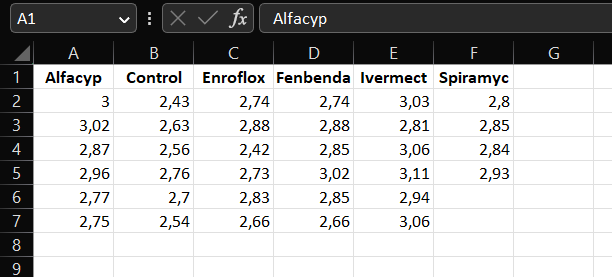
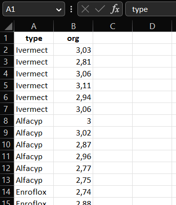

# One-way analysis of variance {#onewayANOVA}

## When to use this model?

One way analysis of variance (one-way ANOVA) may be used to compare the mean in  two or more populations based on a sample from each population. 

*Less formally:* when you measure a numerical/quantitative outcome and your observations are sampled from different groups! 

```{example y1, antibio, name = "Antibiotics and dung decomposition"}
Bags of dung collected from 34 heifers that were fed with a standard feed possibly with different types of antibiotics added. The bags were dug into the soil for eight weeks, and the amount of organic material was measured for each bag. 
```




The purpose of one-way analysis of variance is to use the dataset to estimate and compare the average amount of organic material between groups as it would have looked if we had an infinitely large sample from each group. For a full description of the dataset see ... . 

```{example y2, dogs, name = "Left atrial volume in dogs"}
The maximal volume of the left atrial in mL was measured in 97 dogs of five different breeds. A subset of the dataset is displayed below
```

```{r y3 ,echo = FALSE, message = FALSE, warning = FALSE}
library(readr)
dogs <- read_table("data/1_2_hunde.txt")
set.seed(2023)
head(dogs[sample(97), -2], 10)
```

One-way ANOVA may be used to decide if this small dataset supports general statements of the form: the mean value of the maximal volume of the left atrial differs between breeds (or more specifically between breeds *A* and *B*). This is part of a larger dataset presented in the paper ... .

## Organisation of data and data import

There are basically two popular ways to organise data for a one-way ANOVA: *wide format* and *long format*. 

In *wide format* measurements from separate groups are stored in separate columns ...


Note that for data to be used in a one-way ANOVA there is no link between observations from different columns stored in the same row. If you believe that there is a connection/dependence between observations in the same row, then one-way ANOVA may not be the appropriate statistical analysis method. A common example of this is when data in the same row represent measurements on the same individual under different conditions or at different time points. Look [here](#mixedmodels) for more relevant models.

In *long format* each observation / measurement is stored in the same column and information in some other column is used to identify observations from the same group ...



Whether data should be stored in wide or long format may depend on the software used to carry out the one-way ANOVA. In R it is recommended to use the long format. Below we show how to read in data stored in both formats, and how to use R to transform data from wide to long format.

```{r y4, warning=FALSE, message=FALSE}
library(readxl)
antibio_wide <- read_excel("data/1_1_B_antibio_wideformat.xlsx")
head(antibio_wide)
```

We want all the different treatment groups together in one column which we call `type`. This is because we want the reponse, `org`, to be in one column as well, so we have one observation per row (instead of the 6 observations per row). To fix this we will be using the function `pivot_longer()` in the `tidyverse` package:

```{r y5,message=FALSE,warning=FALSE}
library(tidyverse)
antibio_long <- pivot_longer(antibio_wide, cols = 1:6, names_to = "type", values_to = "org")
head(antibio_long)
```
Now the data is in the *long format*. However. if we look at a summary of the data

```{r y6}
summary(antibio_long)
```

we can see that doing the `pivot_longer()` command has produced two `NA`s. This is because there are two fewer observations of the antibiotic `Spiramyc`, which then have been set to `NA`. These two `NA` observations can in this case be removed

```{r y7}
library(tidyr)
antibio_long <- drop_na(antibio_long)
```


## Data exploration

Below we use the `antibio` dataset which is available in the R package `isdals` (so no need to run the code above to get data into R):

```{r y8, warning=FALSE,message=FALSE}
library(isdals)
data(antibio)
head(antibio)
```

Data may be visualised by a boxplot

```{r y9}
boxplot(org ~ type, data = antibio, xlab = "Antibiotic added to feed", ylab = "Organic material")
```

or by a scatterplot

```{r y10}
library(ggplot2)
ggplot(data = antibio) + geom_point(aes(x = type, y = org)) + labs(x = "Antibiotic added to feed", y = "Organic material")

```

It is convenient to compute summarizes of the outcome divided by group

```{r y11}
antibio_tab <- summarise(group_by(antibio, type), n = n(), mean_org = mean(org), sd_org = sd(org), median_org = median(org))
antibio_tab
```

The dataset with grouped summaries may be used to display the mean in each group with added error bars indicating the size of the standard deviation.

```{r y12}
# Default bar plot
p <- ggplot(antibio_tab, aes(x = type, y = mean_org, fill = type)) + 
  geom_bar(stat="identity", 
           position=position_dodge(), width = .65) +
  geom_errorbar(aes(ymin = mean_org - sd_org, ymax = mean_org + sd_org), width=.2,
                 position=position_dodge(.9)) 
# Finished bar plot
p + labs(title="Barplot of sample means with error bars (+/- SD)", x="Antibiotic added to feed", y = "Organic material", fill = "Antibiotic")
```


## Fitting the model

The one-way ANOVA model is fitted in R using the `lm()` function. The `lm()` function returns an object of class `lm` containing many components that may be of interest to the user. Different useful functions to extract various components from an `lm` object are described in the following sections. 

Basically, the `lm` object obtained by fitting a one-way ANOVA model contains all information required to describe the estimated mean for each group and the variability of the estimates due to the fact that we only have a fairly small sample (from an infinitely large target population).

An important point is that the way the estimated group means are stored depends on the `formula` used to fit the model. It might be useful for you to skip the following and go directly to section about [`emmeans`](#emmeans1)

### ... with default reference group

The one-way ANOVA model for Example  \@ref(exm:antibio) may be fitted using

```{r y13}
m1 <- lm(org ~ type, data = antibio)
summary(m1)
```

But note that here the estimates of the model are stored as

* the estimate for the mean of the outcome in a reference group
* the estimate of the difference between the mean of any other group and the reference group

The reference group is chosen as the first in alpahbetic order of the labels of the group (here given by the variable `type`). For this dataset the reference group is `type = Alphacyp`. The output from the `summary()` function tells us that the estimated mean amount of organic matter is `r coef(m1)[1]` for the reference group (`Alphacyp`), and that e.g. the estimated difference between mean in the group `type = Ivermect` and the reference group is 0.107. E.g. the estimated mean for `type = Ivermect` is 2.895+0.107 = 3.002.

### .. without a reference group

To fit a linear model without a reference group, one can add `-1` to the formula to remove the `Intercept`:

```{r y14}
m2 <- lm(org ~ type - 1, data = antibio)
summary(m2)
```
Here the `lm` object stores estimates for the mean amount of organic matter for any specific `type`, e.g. for `type = Enroflox` the corresponding estimate is 2.71. 

The `Std. Error` is the standard error of the estimates. When the estimates are obtained just a the sample average of observations in a group, the `Std. Error` is computed as the estimated with-in group standard deviation (in output: `Residual standard error`) divided by the square root of the number of observations in the group.

### ... with user defined reference group

To change the reference group we can use `relevel()` when fitting the model. Here it is important to note that `relevel()` can only be used on variables of type `factor`:

```{r y15}
m3 <- lm(org ~ relevel(factor(type), ref = "Control"), data = antibio)
summary(m3)
```

Now the reference group is `type = Control`. This means that the estimate for the `Intercept` `r round(coef(m3)[1], 3)` is the estimated mean amount of organic matter for the `Control` group. The predicted values for the other types can be calculated the same way as above.

### Digging more into the output from `summary()`

Let us fit the one-way ANOVA model with `Control` as reference group. If it is indisputable which group should be the reference group I may be convenient to change this as indicated here:

```{r y16}
antibio$type <- relevel(factor(antibio$type), ref = "Control")
m4 <- lm(org ~ type, data = antibio)
summary(m4)
```

When you look at a `summary()` of an `lm` object proceed as follows:

* Make sure that you understand what the content in each row of the `Coefficients` table is about. In the output above:
    - `(Intercept)`: everything in this row is about the estimated mean in the reference group (`type = Control`)
    - `typeAlphacyp`: everything in this row is about the estimate for the difference between means in the `Alphacyp` group and the reference group
    - `typeEnroflox-typeSpiramyc`: same as for `typeAlphacyp`
* `Estimate`: contains the estimate for the parameter (could be either the mean in the `Control` group or a difference to the `Control` group)
* `Std. Error`: contains the sampling variation of the estimate (that you would expect to observe if you repeated your experiment and computed the estimate over and over again)
* `t value + Pr(>|t|)`: the t-test statistic and the corresponding P-value for testing that the target parameter (for the corresponding row) equals zero. This is most likely only relevant, if the target parameter of the row is a difference between means. 

For this specific example the last five rows of the `Coefficients` table concerns differences between the mean amount of organic matter when one of the five types of antibiotics is added to the feed, and the mean amount if no antibiotics is added. 

As lower P-values are evidence against the null hypothesis (here: no difference compared to `Control`) we conclude that all antibiotics except `Enroflox` appears to increase the content of organic matter in bags.

The `confint()` function constructs confidence intervals for the target parameters based the a model fitted with the `lm()` function. 

```{r y17}
confint(m4)
```

For the model `m4` where `Control` is used a reference when communicating the estimates then we get 95 % confidence intervals for the mean content of organic matter in the `Control` group, and 95 % confidence intervals for difference between mean amount in any other group and the `Control` group.

The confidence interval for the difference between the mean amount in the `Alphacyp` group and the `Control` group is [0.148, 0.436]. The fact that zero is not contained in this interval is consistent with our finding from the output of `summary(m4)`: the P-value of 0.000281 indicate that there is a significant difference between the mean of the two groups.

## Validating the model

### Why do I need to valide the model?

The one-way ANOVA estimates the mean of each population by the average of observations from each group. But it also quantifies the uncertainty of the estimates (due to sampling variation) assuming that

* observations within each group are independent
* observations within each group follows a normal distribution with equal variances

All that we extract from the one-way ANOVA model about uncertainty of estimates (later also tests) is only valid if the model assumptions are valid. 

### How do I validate the model assumptions?

***Something about independence assumption***

We must basically just check that observations within each group looks like an (independent) sample from a normal distribution and that the variances (but not necessarily the means) are the same. 

**Be careful:** Do not check that the pooled dataset looks like a sample from a normal distribution!

**Show how to extract residuals, using group_by -> summarise to check variation within each group**

```{r y18,message=FALSE,warning=FALSE}
library(tidyverse)
summarise(group_by(antibio, type), mean_org = mean(org), sd_org = sd(org))
```
Here the sd_org should be approximately the same, if we want to use one-way-ANOVA


**Show how to make residual plot and qqplot. Make note about difference between residuals and standardized residuals.**


Residual plot
```{r y19}
antibio_residuals <- resid(m2) 

plot(antibio$org, antibio_residuals,
     ylab="Residuals",
     xlab="org", main="Residual plot of antibio data") 
abline(0, 0) 
```
When looking at an residual plot, it is important that the residuals are:

* Distributed randomly around the 0,0 line (i.e. there are no patterns).
* Cluster around the middle of the plot
* They are around the lower single digits of the y-axis (i.e the variance of the residuals is small)

In this plot it may be hard to see as it has few observations. It all in all looks random but there are a few concerns at org == 2.4 and org > 3, as there the residual are only at one side of the line.


standardized residuals (often used to identify outliers, where if the standardized residual is greater than +/- 3 it's probably an outlier)
```{r y20}
antibio_standard_res <- rstandard(m2)

plot(antibio$org, antibio_standard_res,
     ylab="Standardized residuals",
     xlab="org", main="Standardized Residual plot of antibio data") 
abline(0, 0)
```


qq-plot (do this for all types)
```{r y21}
types <- unique(antibio$type)
{qqnorm(antibio$org[which(antibio$type==types[6])], pch = 1, frame = FALSE)
qqline(antibio$org[which(antibio$type==types[6])], col = "steelblue", lwd = 2)}
```

### What to do if the model is not valid?

**Show example where things do not look good. Link to section on alternatives.**


```{r y22,message=FALSE,warning=FALSE}
library(tidyverse)
summarise(group_by(dogs, race), mean_maxLA = mean(maxLA), sd_maxLA = sd(maxLA))
```
Here the standard deviation between the groups varies alot, which means one-way-ANOVA is not the right method to use.


Residual plot for dogs dataset
```{r y23}
m4 <- lm(maxLA ~ race, data = dogs)

dogs_residuals <- resid(m4) 

plot(dogs$maxLA, dogs_residuals,
     ylab="Residuals",
     xlab="maxLA", main="Residual plot of dogs data") 
abline(0, 0) 
```

qq-plot for dogs data (do this for all different races of dogs)
```{r y24}
races <- unique(dogs$race)
{qqnorm(dogs$maxLA[which(dogs$race==races[3])], pch = 1, frame = FALSE)
qqline(dogs$maxLA[which(dogs$race==races[3])], col = "steelblue", lwd = 2)}
```


## Extracting estimates with `emmeans()`

The `emmeans` R package is useful for extracting estimates for means or differences between means based on a one-way ANOVA model.

```{r y25}
library(emmeans)
model1 <- lm(org ~ type, data = antibio)
```

To get estimates and all pairwise comparisons with the `control` group use

```{r y26}
emmeans(model1, specs = trt.vs.ctrlk ~ type, ref = "Control")
```

**Interpretation of output:** ....

To get all pairwise comparisons between group mean with P-value adjustment correspoding to the Tukey test use

```{r y27}
emm1 <- emmeans(model1, specs = "type")
pairs(emm1)
```
**Interpretation of output:** ....

## Reporting the results 

Focus on 

* how to avoid errors when transferring results from R to you manuscript
* how to make it easy to update results, figures

### Tables

How to export a nice table.

* as csv-file
* as csv-file in a format that fits into a table in a manuscript written in word
* as latex output

Here is a function that transforms data in a long format to a nice table. The first argument it needs is the dataframe used. The second is a vector of the variables, which in this example is the variable `org`. The third argument is the factor variable we were interested in compairing means of, i.e. the different groups used in the One-way-ANOVA (This can either be the different names or the whole column from the data). The number of digits can also be varied by changing the `digits` argumnet. `Switch` controls what kind of table the function outputs (this will be shown below).
```{r y28}
table_func <- function(df, var, fact_Names,digits=2, Switch=TRUE){
  Names <- na.omit(fact_Names)
  Names <- as.character(unique(Names))
  df2 <- data.frame(matrix(NA,    # Create empty data frame
                          nrow = length(var),
                          ncol = (length(Names)+1)*3+1))
  Names_new <- rep(NA,3*length(Names))
  for(i in 1:length(Names)){
    Names_new[(i*3+1)-3] <- paste0(Names[i],"_n")
    Names_new[(i*3+1)-2] <- paste0(Names[i],"_mean")
    Names_new[(i*3+1)-1] <- paste0(Names[i],"_SD")
  }
  names(df2) <- c("Variables","Total_n","Total_mean","Total_SD",Names_new)
  df2$Variables <- var
  for(i in 1:length(var)){
    df2$Total_n[i] <- sum(!is.na(df[,which(names(df)==var[i] )]))
    df2$Total_mean[i] <- round(mean(df[which(!is.na(df[,which(names(df)==var[i] )])),which(names(df)==var[i] )]),digits)
    df2$Total_SD[i] <- round(sd(df[which(!is.na(df[,which(names(df)==var[i] )])),which(names(df)==var[i] )]),digits)
    for(t in 1:length(Names)){
      df2[i,which(names(df2)==Names_new[(t*3+1)-3])] <- sum(!is.na(df[which(fact_Names==Names[t]),which(names(df)==var[i] )]))
      df2[i,which(names(df2)==Names_new[(t*3+1)-2])] <- round(mean(df[which(!is.na(df[,which(names(df)==var[i] )]) & fact_Names==Names[t]),which(names(df)==var[i] )]),digits)
      df2[i,which(names(df2)==Names_new[(t*3+1)-1])] <- round(sd(df[which(!is.na(df[,which(names(df)==var[i] )]) & fact_Names==Names[t]),which(names(df)==var[i] )]),digits)
    }
  }
  
  df3 <- data.frame(matrix(NA,    # Create empty data frame
                          nrow = length(var),
                          ncol = (length(Names)+1)*2+1))
  Names_neww <- rep(NA,2*length(Names))
  for(i in 1:length(Names)){
    Names_neww[(i*2+1)-2] <- paste0(Names[i],"_n")
    Names_neww[(i*2+1)-1] <- paste0(Names[i],"_mean(SD)")
  }
  names(df3) <- c("Variables","Total_n","Total_mean(SD)",Names_neww)
  df3$Variables <- var
  df3$Total_n <- df2$Total_n
  df3$`Total_mean(SD)` <- paste0(round(df2$Total_mean,digits),"(",round(df2$Total_SD,digits),")")
  for(i in 1:length(var)){
    for(t in 1:length(Names)){
      df3[i,which(names(df3)==Names_neww[(t*2+1)-2])] <- df2[i,which(names(df2)==Names_new[(t*3+1)-3])]
      df3[i,which(names(df3)==Names_neww[(t*2+1)-1])] <- paste0(round(df2[i,which(names(df2)==Names_new[(t*3+1)-2])],digits),"(",round(df2[i,which(names(df2)==Names_new[(t*3+1)-1])],digits),")")
    }
  }
  
  if(Switch){
    return(df2)
  }
  else return(df3)
  
}
```

Now we use the function on the antibio data
```{r y29}
table_func(antibio,c("org"), antibio$type,Switch = TRUE)
```
If switch is set to `FALSE` the means and SD columns are merged
```{r y30}
table_func(antibio,c("org"), antibio$type,Switch = FALSE)
```


### Figures

Focus on

* how to polish a figure
* how to save/export a figure

basic plot
```{r y31}
library(ggplot2)
ggplot(data = antibio) + 
  geom_point(aes(x = type, y = org))
```

With custom labels and title
```{r y32}
ggplot(data = antibio) + 
  geom_point(aes(x = type, y = org)) +
  labs(title = "Scatterplot of Antibio dataset", x = "Antibiotic added to feed", y = "Organic material")
```

Adding colours to the dots
```{r y33}
ggplot(data = antibio) + 
  geom_point(aes(x = type, y = org, colour = type)) + 
  labs(title = "Scatterplot of Antibio dataset", x = "Antibiotic added to feed", y = "Organic material")
```


Choosing the colours (See http://www.cookbook-r.com/Graphs/Colors_(ggplot2)/ for the colours available, but you can usually just spell the colour you want i.e. "blue" or "red" as done in the example)
```{r y34}
ggplot(data = antibio) + 
  geom_point(aes(x = type, y = org, colour = type)) + 
  labs(title = "Scatterplot of Antibio dataset", x = "Antibiotic added to feed", y = "Organic material") +
  scale_color_manual(values=c("#999999", "#E69F00", "#56B4E9","red","#330000","#00FF33","blue"))
```


To save/export a figure as a pdf, png or jpeg, one can use this method. The code is the same for all three formats expect the dimensions needs to be changed for the chosen format. 
```{r y35, eval=F, echo=T}
# Step 1: Call the pdf command to start the plot

pdf(file = "~/Desktop/test.pdf",   # The directory you want to save the file in
    width = 10, # The width of the plot in inches
    height = 8) # The height of the plot in inches

# png(file = "~/Desktop/test.png",
#      width = 800,
#      height = 600)

# jpeg(file = "~/Desktop/test.jpeg",
#      width = 800,
#      height = 600)

# Step 2: Create the plot with R code
ggplot(data = antibio) + 
  geom_point(aes(x = type, y = org, colour = type)) + 
  labs(title = "Scatterplot of Antibio dataset", x = "Antibiotic added to feed", y = "Organic material") +
  scale_color_manual(values=c("#999999", "#E69F00", "#56B4E9","red","#330000","#00FF33","blue"))

# Step 3: Run dev.off() to create the file!
dev.off()
```


### Stat methods section

How to write a stat methods section: list a couple of papers reporting results of a simple and clean analysis using one way ANOVA.

Possibly a list that can be updated continuously.

## Alternatives and related statistical methods

### Analysis on logtransformed scale {#logtrans}

* Interpretation/backtransformation (summary + emmeans). Comment about difference. 

* Tests not assuming equal variances (spec: welch test) as alternative to using other transformations.

* Handling of zeroes: zero-inflated models, detection limits, subtracting a baseline

### Relation to t-tests and non-parametric testing {#onewaynonpar}

* Two groups: t-test / Mann-Whitney, levene-test

* More groups: Wilcoxon-test

### When data are not normally distributed {#bootstrap}

Non-parametric bootstrap of estimates, std. errors, CI, test-statistics.

Show code that compares results of summary with non-parametric bootstrap.


